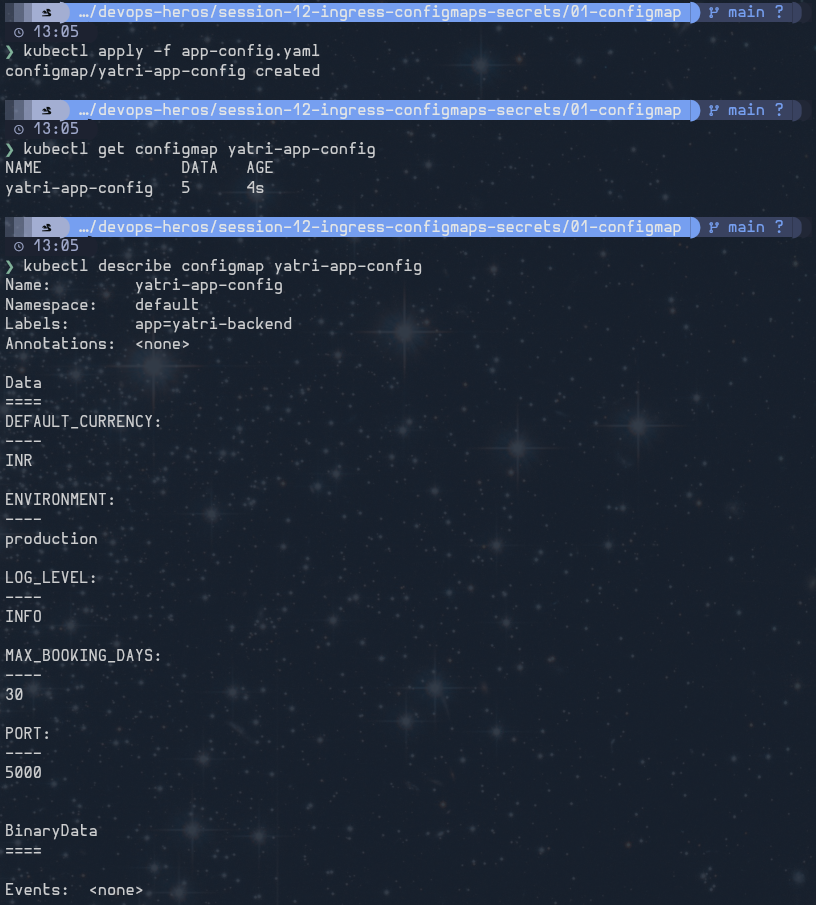
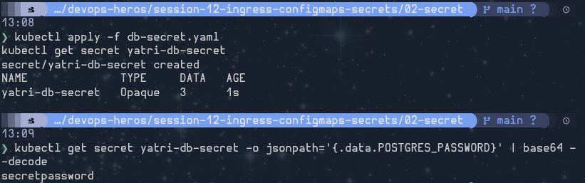

## Ingress vs. Ingress Controller

An **Ingress** is a Kubernetes API resource that defines HTTP/HTTPS routing rules. It maps incoming requests—for example, a host name or URL path—to Services inside the cluster.

An **Ingress Controller** is the software that watches those Ingress resources and enforces their rules. It runs a reverse proxy or load balancer, such as NGINX Ingress Controller, and actually receives and routes the traffic.

In short: **Ingress describes the routing; the Ingress Controller performs the routing.**

## Screenshots

