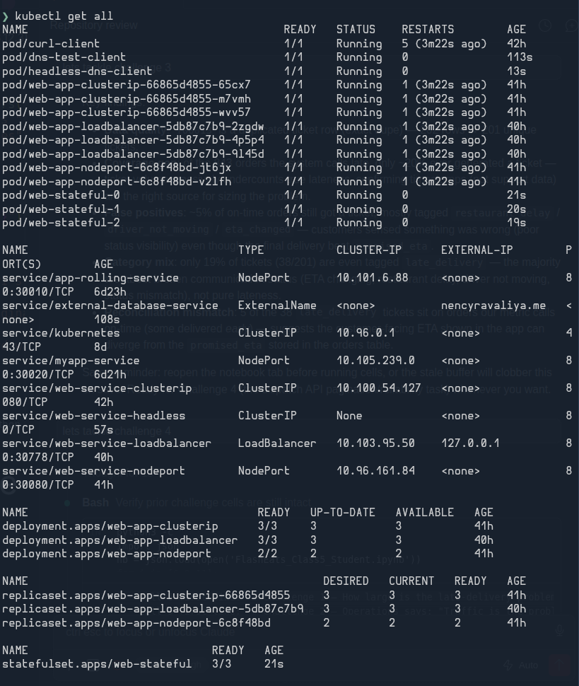
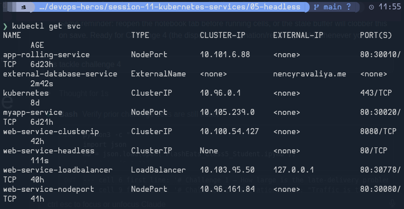

## What I understood about Kubernetes ports

I understand the flow as: a request enters the Service through `port`, Kubernetes forwards it to `targetPort`, and the application listens on that port inside the container.

- `port` is the Service-facing port. Other pods can reach the Service through it, for example: `my-service:80`.
- `targetPort` is the port where the application actually receives traffic. For example, the Service can accept traffic on `80` and forward it to an app running on `8080`. When it is not specified, it uses the same value as `port`.
- `containerPort` shows the port my application listens on inside the container. I can also name it and refer to that name from a Service or probe. Defining `containerPort` alone does not expose the application.

```yaml
# Requests to my-service:80 are sent to the app on port 8080.
ports:
  - port: 80
    targetPort: 8080
```
