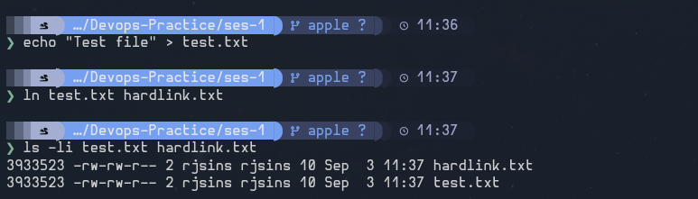
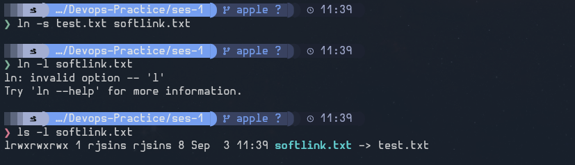
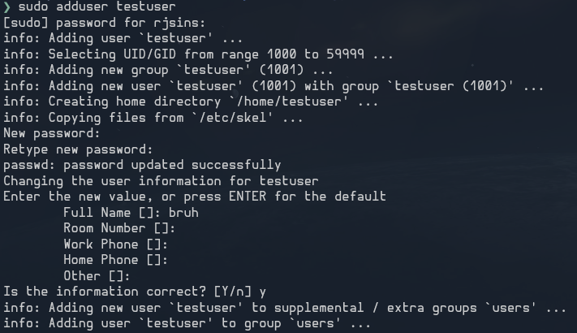
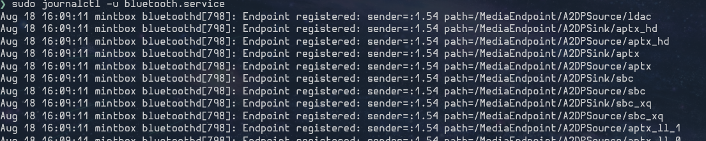
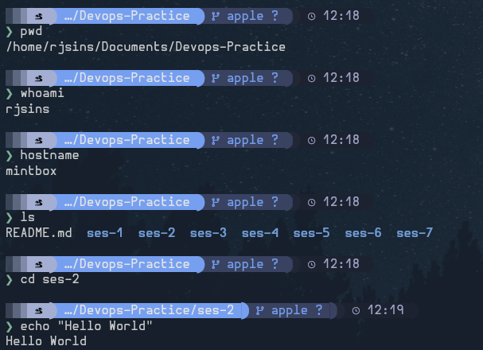

***Task 1:***

**Hard link:** A hard link points directly to the same data as the original file, so it remains valid even if the original filename is deleted.

**Soft link:** A soft link points to the original file’s path, can cross file systems, and becomes broken if the target is deleted or moved.

Hard link:

Soft link:

***Task 2:***

**useradd:** `useradd` is a low-level command for creating users.

**adduser:** `adduser` is a more user-friendly interactive script that acts as a friendlier frontend to useradd.

***Task 3:***

`journalctl` is used to view and query logs collected by the systemd journal, which helps monitor and troubleshoot system services.

***Task 4:***

