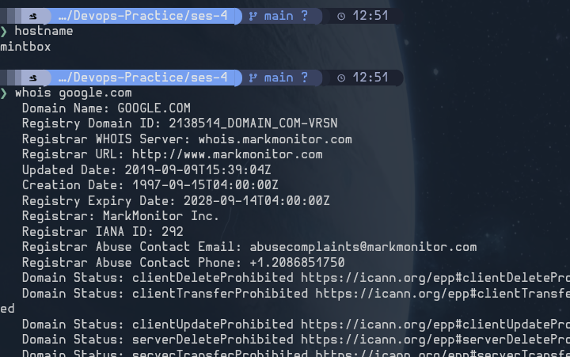
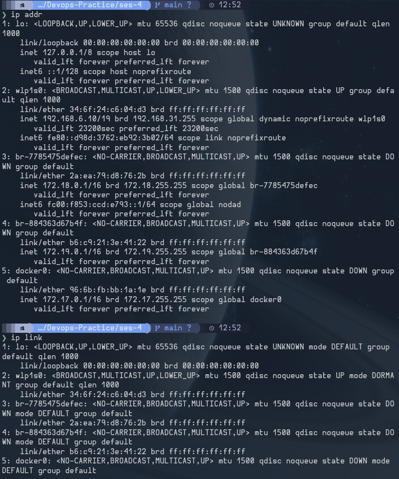
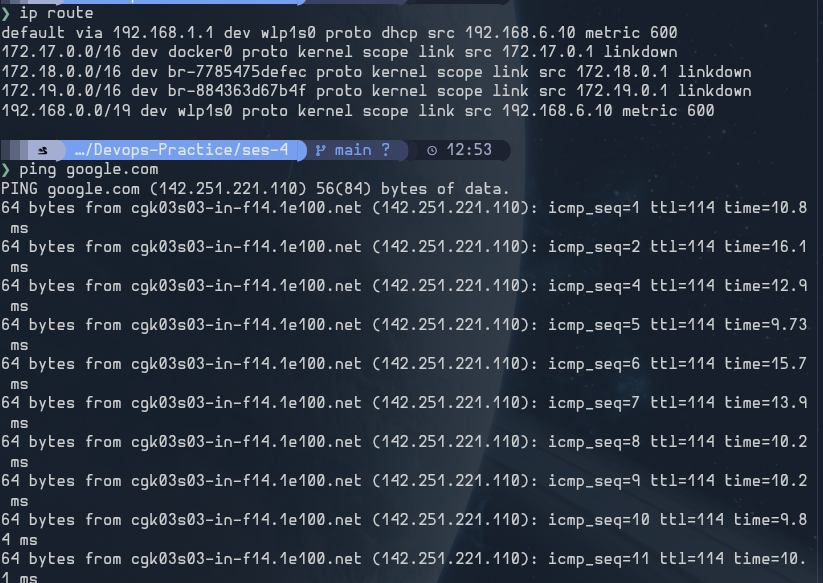
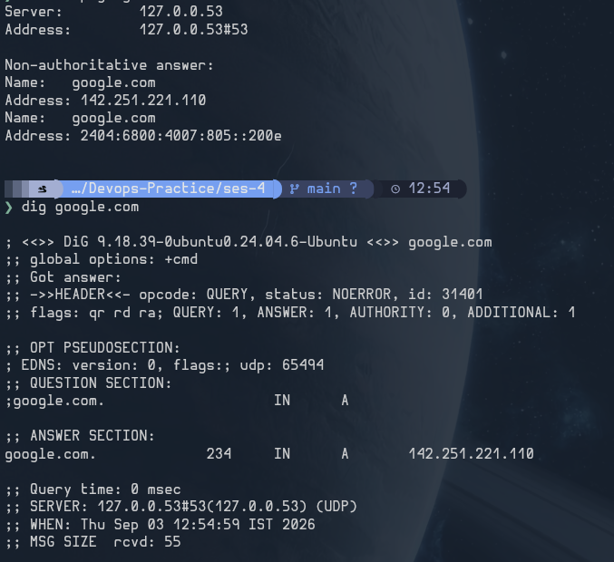
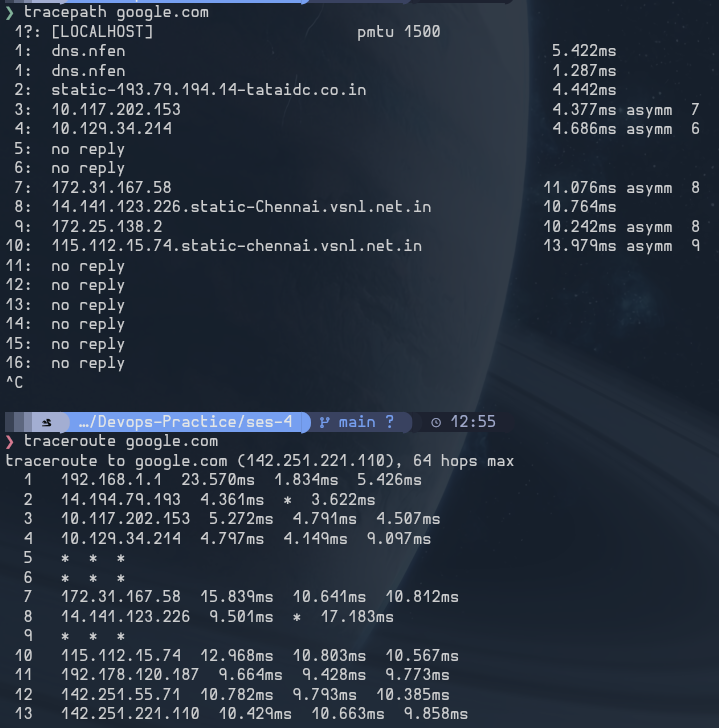

# Linux Networking Commands

- `ip addr` — Displays the network interfaces and their assigned IP addresses.
- `ip link` — Shows and manages the state of network interfaces.
- `ip route` — Displays or modifies the system's routing table.
- `ping <host>` — Tests whether a host is reachable and measures round-trip latency.
- `traceroute <host>` — Shows the network hops packets take to reach a destination.
- `tracepath <host>` — Traces a route and reports path MTU information without requiring special privileges.
- `nslookup <domain>` — Queries DNS to find information about a domain or hostname.
- `dig <domain>` — Performs detailed DNS lookups and displays the server's response.
- `host <domain>` — Performs a simple DNS lookup for a hostname or domain.
- `curl <url>` — Sends requests to URLs and is useful for testing web services and APIs.
- `ssh user@host` — Connects securely to a remote Linux system through an encrypted session.
- `tcpdump -i <interface>` — Captures and analyzes network packets on a selected interface.
- `hostname` — Displays or sets the system's hostname.
- `whois <domain>` — Retrieves registration and ownership information for an Internet domain or IP address.

